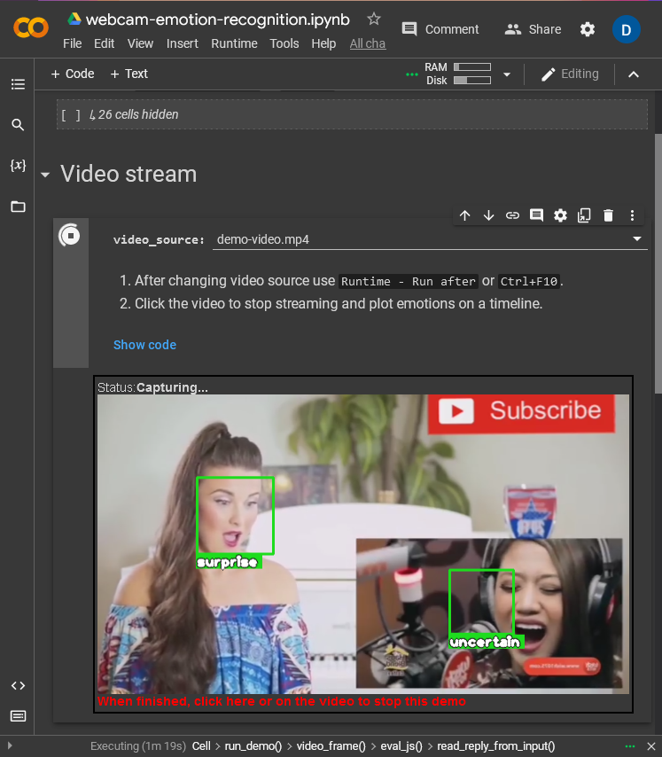
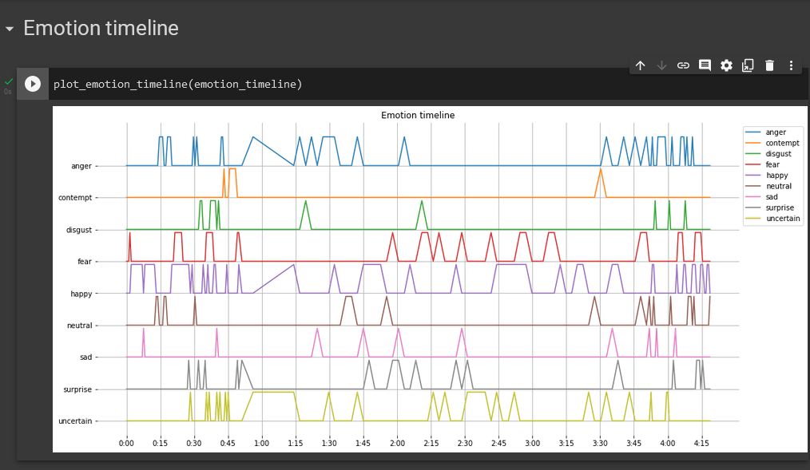
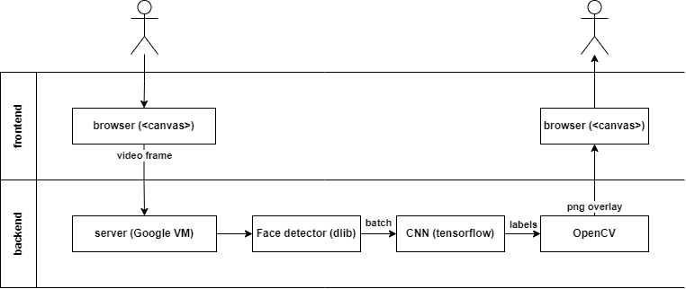

# Система отслеживания эмоций с помощью веб камеры

1. [Описание](#Описание)
1. [Инструкция](#Инструкция)
1. [Детали реализации](#Детали-реализации)

## Описание

* Работает с веб-камерой, отслеживает положение лица и определяет эмоцию.
* Не требует установки.
* Требуется браузер с доступом к веб-камере на устройстве (ноутбук, телефон, планшет).

## Инструкция

1. Откройте [Google Colab](https://colab.research.google.com/drive/1cvAZvsXXbZHi--QFNJDfTJEGB1JapKvo?usp=sharing).
1. Запустите код на выполнение, выбрав в меню `Runtime → Run all` (<kbd>Ctrl+F10</kbd>).
   * Начальная инициализация займет около 30 секунд.
1. После успешного запуска, детектор начнет анализировать видео-поток и отрисовывать аннотации с названием эмоций.
   * Убедитесь, что лицо на видео хорошо различимо:
     * Имеет достаточное освещение
     * Не слишком мелкое
     * Расположено вертикально и направлено в сторону камеры
     
1. Список распознаваемых эмоций:
   1. **neutral** (нейтральное выражение лица)
   1. **anger** (гнев)
   1. **fear** (страх)
   1. **disgust** (отвращение)
   1. **surprise** (удивление)
   1. **contempt** (презрение)
   1. **happy** (радость)
   1. **sad** (грусть)
   1. **uncertain** (другое)
2. Чтобы прервать видео, достаточно по нему кликнуть.
3. После остановки видео будет построен график эмоций на временной шкале.
    

## Детали реализации

Клиент-серверная архитектура системы:

- Сверточная сеть (CNN) используется для классификации изображений на 9 классов (по числу эмоций).
- В качестве сверточной сети используется **MobileNet** (255k params, 1MB) предобученная (pre-trained) на ImageNet и дообученная (fine-tuned) на датасете из 50 000 изображений (2.27G).

